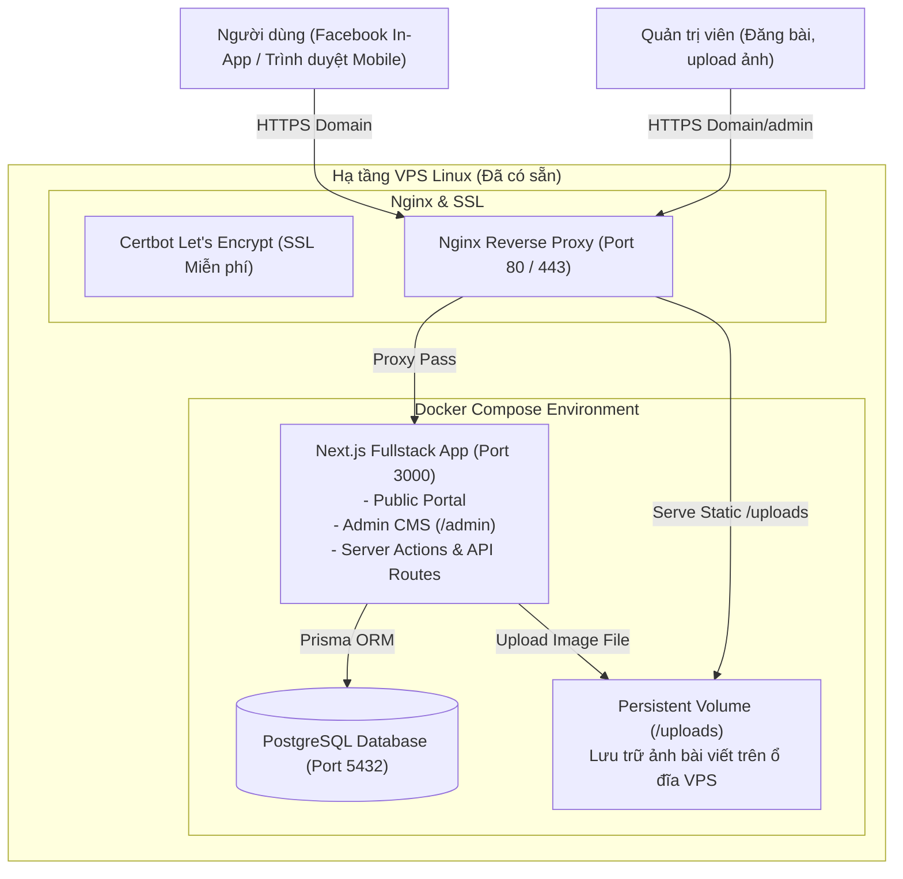
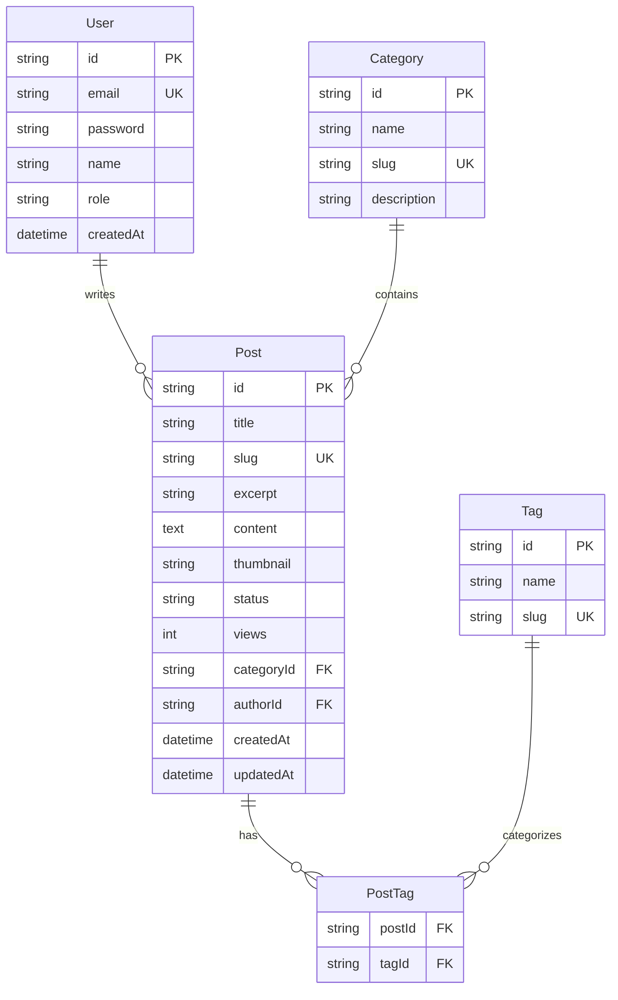

# System Architecture & Design: FinPulse Portal

## 1. Kiến trúc hạ tầng trên VPS (0đ phát sinh)

Tận dụng 100% tài nguyên của VPS hiện có, đóng gói toàn bộ dịch vụ qua Docker Compose để dễ bảo trì, sao lưu và không tốn chi phí thuê SaaS bên thứ ba.

---

## 2. Lựa chọn Tech Stack kỹ thuật

| Thành phần | Lựa chọn | Lý do tiết kiệm & tối ưu |
| :--- | :--- | :--- |
| **Framework** | **Next.js (App Router)** | Gộp cả Frontend & Backend API trong 1 tiến trình duy nhất (giảm 50% RAM so với tách riêng FE/BE). Hỗ trợ Server-Side Rendering (SSR) sinh thẻ Open Graph cho Facebook Bot. |
| **Database** | **PostgreSQL (Docker)** | Hệ quản trị CSDL quan hệ chuẩn, mạnh mẽ, bền bỉ, chạy container chỉ tốn ~100MB RAM. |
| **ORM** | **Prisma** | Schema type-safe, tự động generate migrations, dễ query và bảo trì. |
| **Authentication** | **NextAuth.js (Auth.js)** | Xác thực trực tiếp trong Next.js bằng tài khoản Admin bí mật mã hóa bcrypt, không cần dịch vụ auth bên ngoài. |
| **Lưu trữ ảnh** | **Local Volume + Nginx Static Serve** | Lưu file trực tiếp vào thư mục trên ổ đĩa VPS, Nginx làm nhiệm vụ cache và trả ảnh cực nhanh với chi phí 0đ. |
| **Trình soạn thảo** | **TipTap (Headless WYSIWYG)** | Rất nhẹ, hỗ trợ paste ảnh, kéo thả, tạo heading, trích dẫn, code block. |
| **Proxy & SSL** | **Nginx + Let's Encrypt** | Tự động gia hạn chứng chỉ bảo mật HTTPS miễn phí vĩnh viễn. |

---

## 3. Thiết kế CSDL (Database Schema)

---

## 4. Tối ưu hóa chia sẻ Facebook (Facebook OpenGraph Pipeline)

Khi người dùng dán link bài viết lên Fanpage Facebook:
1. Facebook Crawler gửi request đến URL `https://yourdomain.com/posts/[slug]`.
2. Next.js Server Component render trước mã HTML chứa các thẻ:
   - `<meta property="og:title" content="Tiêu đề bài viết hấp dẫn" />`
   - `<meta property="og:description" content="Tóm tắt nội dung 1-2 câu kích thích tò mò" />`
   - `<meta property="og:image" content="https://yourdomain.com/uploads/thumbnail-1200x630.jpg" />`
   - `<meta property="og:type" content="article" />`
3. Facebook hiển thị bài viết dạng **Card ảnh lớn** (Large Image Card) giúp tăng tỷ lệ click (CTR) từ Fanpage về Website lên gấp 3-5 lần so với card ảnh nhỏ.
